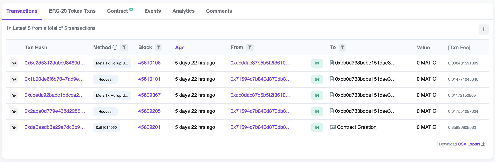

# Lens Tell 🔮 for LensAPI Oracle

- [Overview](#overview)
- [Prerequisites](#prerequisites)
- [Getting Started](#getting-started)
  - [Environment Variables](#environment-variables)
- [Deployment](#deployment)
  - [Deploy to Polygon Mumbai Testnet](#deploy-to-polygon-mumbai-testnet)
    - [Verify Contract on Polygon Mumabai Testnet](#verify-contract-on-polygon-mumbai-testnet)
    - [Interact with Consumer Contract on Polygon Mumbai](#interact-with-consumer-contract-on-polygon-mumbai)
- [Closing](#closing)

## Overview
This project represents a basic Polygon Consumer Contract that is compatible with a deployed LensAPI Oracle via [Phat Bricks UI](https://bricks.phala.network).

## Prerequisites
- Active deployed LensAPI Oracle Blueprint via [Phat Bricks](https://bricks.phala.network)
- Address of the "[Oracle Endpoint](https://docs.phala.network/developers/bricks-and-blueprints/featured-blueprints/lensapi-oracle#step-3-connect-your-smart-contract-to-the-oracle)" in deployed LensAPI Oracle
- [Hardhat](https://hardhat.org)
- For Polygon Mainnet deployments:
  - Polygonscan API Key that can be generated on [polygonscan](https://polygonscan.com)
- RPC Endpoint for Polygon Mainnet & Mumbai Testnet
  - [Alchemy](https://alchemy.com) - This repo example uses Alchemy's API Key.
  - [Infura](https://infura.io)
  - Personal RPC Node

## Getting Started
First you will need to run `cp .env.local .env` to copy over the local environment variables.
### Environment Variables:
- `MUMBAI_RPC_URL` - JSON-RPC URL with an API key for RPC endpoints on Polygon Mumbai Testnet (e.g. [Alchemy](https://alchemy.com) `https://polygon-mumbai.g.alchemy.com/v2/<api-key>`, [Infura](https://infura.io) `https://polygon.infura.io/v3/<api-key>`).
- `POLYGON_RPC_URL` - JSON-RPC URL with an API key for RPC endpoints on Polygon Mainnet (e.g. [Alchemy](https://alchemy.com) `https://polygon.g.alchemy.com/v2/<api-key>`, [Infura](https://infura.io) `https://polygon.infura.io/v3/<api-key>`).
- `DEPLOYER_PRIVATE_KEY` - Secret key for the deployer account that will deploy the Consumer Contract on either Polygon Mainnet or Polygon Mumbai Testnet.
- `POLYGONSCAN_API_KEY` - Polygonscan API Key that can be generated at [polygonscan](https://polygonscan.com).
- `MUMBAI_LENSAPI_ORACLE_ENDPOINT` - LensAPI Oracle Endpoint Address that can be found in the dashboard of the deployed LensAPI Oracle Blueprint at [Phala PoC5 Testnet](https://bricks-poc5.phala.network) for Polygon Mumbai Testnet.
- `POLYGON_LENSAPI_ORACLE_ENDPOINT` - LensAPI Oracle Endpoint Address that can be found in the dashboard of the deployed LensAPI Oracle Blueprint at [Phala Mainnet](https://bricks.phala.network) for Polygon Mainnet.

## Deployment
Now that you have the prerequisites to deploy a Polygon Consumer Contract on Polygon, lets begin with some initials tasks.
### Install Dependencies & Compile Contracts
```shell
# install dependencies
$ yarn

# compile contracts
$ yarn compile
```
### Deploy to Polygon Mumbai Testnet
With the contracts successfully compiled, now we can begin deploying first to Polygon Mumbai Testnet. If you have not gotten `MATIC` for Mumbai Testnet then get `MATIC` from a [faucet](https://mumbaifaucet.com/).
Ensure to save the address after deploying the Consumer Contract because this address will be use in the "[Configure Client](https://docs.phala.network/developers/bricks-and-blueprints/featured-blueprints/lensapi-oracle#step-4-configure-the-client-address)" section of Phat Bricks UI. The deployed address will also be set to the environment variable [`MUMBAI_CONSUMER_CONTRACT_ADDRESS`](./.env.local).
```shell
# deploy contracts to testnet mumbai
$ yarn test-deploy
# Deployed { consumer: '0xFE6185Aad4277C38E9C59DBe17c2319FDf9a4FE2' }
```
#### Interact with Consumer Contract on Polygon Mumbai
Test Consumer Contract on Mumbai with a few tests to check for malformed requests failures, successful requests, and set the attestor.
```shell
# set the attestor to the Oracle Endpoint in Phat Bricks UI
$ yarn test-set-attestor
Setting attestor...
🚨NOTE🚨
Make sure to go to your Phat Bricks 🧱 UI dashboard (https://bricks-poc5.phala.network)
- Go to 'Configure Client' section where a text box reads 'Add Consumer Smart Contract'
- Set value to 0xFE6185Aad4277C38E9C59DBe17c2319FDf9a4FE2
Done
✨  Done in 1.56s.
# execute push-malformed-request
$ yarn test-push-malformed-request
Pushing a malformed request...
Done
# execute push-request
$ yarn test-push-request
Pushing a request...
Done
```

## Closing
Once you have stored, the deployed address of the Consumer Contract and set the value in the "Configure Client" section of the deployed LensAPI Oracle, you will now have a basic boilerplate example of how to connect your Polygon dApp to a LensAPI Oracle Blueprint. Execute a new requests and check if your configuration is correct like below:

